# Github Pages Site Blog ' Set Up


<!--more-->
Github Pages Site Blog Construction process related and reference
<!--more-->

## 框架选择

### Hugo

  - [*About Hugo*](https://gohugo.io/about/)
  - [*Hugo 不完美教程 - I: Hugo Web Framework*](https://www.jianshu.com/p/deaa0e58315a)

### Github pages

- [*Creating a GitHub Pages site*](https://docs.github.com/en/pages/getting-started-with-github-pages/creating-a-github-pages-site)
- [*About GitHub Pages*](https://docs.github.com/cn/pages/getting-started-with-github-pages/about-github-pages)
- [*Changing the visibility of your GitHub Pages site*](https://docs.github.com/en/enterprise-cloud@latest/pages/getting-started-with-github-pages/changing-the-visibility-of-your-github-pages-site)

### Example

- [*使用 Hugo + Github 搭建个人博客*](https://zhuanlan.zhihu.com/p/105021100)
- [*Hugo系列(1) - 简单搭建教程与远程部署*](https://lewky.cn/posts/hugo-1.html/)
- [*ubuntu搭建hugo博客环境*](https://zhuanlan.zhihu.com/p/363942257)
- [*个人博客的创建之路1：hugo 搭建个人博客*](https://juejin.cn/post/6854573210404831239)

## 主题选择

- [*Hugo Themes*](https://themes.gohugo.io/)

- [*LoveIt Theme*](https://hugoloveit.com/zh-cn/)
  `当前的博客主题采用LoveIt主题模板进行搭建的，可以参考LoveIt官方提供的搭建方案，LoveIt提供了丰富的可配置选项。`

  `当前列出 LoveIt 主题的内容链接，方便查看:`
  
  ### **LoveIt**
  
  - [*主题文档 - 基本概念*](https://hugoloveit.com/zh-cn/theme-documentation-basics/)
  - [*主题文档 - 内容*](https://hugoloveit.com/zh-cn/theme-documentation-content/)
  - [*主题文档 - 内置      Shortcodes*](https://hugoloveit.com/zh-cn/theme-documentation-built-in-shortcodes/)
  - [*主题文档 - 扩展      Shortcodes*](https://hugoloveit.com/zh-cn/theme-documentation-extended-shortcodes/)
  - [*Markdown 基本语法*](https://hugoloveit.com/zh-cn/basic-markdown-syntax/)
  - [*Emoji 支持*](https://hugoloveit.com/zh-cn/emoji-support/)

## 主题修改(自定义样式)

​	`参照` [**雨临Lewis**](https://lewky.cn/) `所发表的系列博客`

- [*Hugo系列(3.0) - LoveIt主题美化与博客功能增强 · 第一章*](https://lewky.cn/posts/hugo-3.html/)

- [*Hugo系列(3.1) - LoveIt主题美化与博客功能增强 · 第二章*](https://lewky.cn/posts/hugo-3.1.html/)
- [*Hugo系列(3.2) - LoveIt主题美化与博客功能增强 · 第三章*](https://lewky.cn/posts/hugo-3.2.html/)
- [*Hugo系列(3.3) - LoveIt主题美化与博客功能增强 · 第四章*](https://lewky.cn/posts/hugo-3-3/)

## 仓库搭建

  `参照官方教程即可`

-   [*Creating a GitHub Pages site*](https://docs.github.com/en/pages/getting-started-with-github-pages/creating-a-github-pages-site)


## 构建仓库搭建

  `创建一个仓库用于存储用hugo创建的blog site工程源码`

  `e.g: 工程名称: `***yunzhaoyu2050***`.github.io.source`

  `e.g: 工程文件夹结构:`

```tree
.
├── .git/
├── .gitignore
├── .gitmodules
├── archetypes/
├── assets/
├── config.toml - ***配置文件***
├── content/
├── docs/ - ***工程操作命令记录***
│ └── OperationGuide.md
├── layouts/
├── public/ - ***输出site文件目录***
├── README.md
├── resources/
├── static/
└── themes/
├── LoveIt/
└── minimo/
```

## github action自动化构建流程搭建

- [*GitHub Action + Hugo 自动构建发布个人博客*](https://zhuanlan.zhihu.com/p/240522090)
- [*使用Github(Action)+Hugo搭建自己的博客*](https://blog.csdn.net/weixin_41263449/article/details/107584336)
- [*hugo通过Github Action部署到Github Pages*](https://www.jianshu.com/p/5aa60433850a)
- [*Deploy a Hugo Website to Vercel using GitHub Actions (A simple workflow)*](https://colinwilson.uk/2020/12/25/deploy-a-hugo-website-to-vercel-using-github-actions-a-simple-workflow/)

## 其它

###   参考链接:

  - [*Hugo添加Google Analytics*](https://www.ariesme.com/posts/2019/add_google_analytics_for_hugo/)

- [*gopherize.me头像*](https://gopherize.me/)

  

## blog文章计划

需要制定一些计划去规划文章的分类、编辑、发布等，目的是不让文章在数量增大的情况下管理变的混乱，管理混乱就容易将当前工程变烂。


***当前的这些规划只针对我个人的需求，不具备通用性。***


###   编辑器选择

- vscode
- typora


`通常我会两个一起使用，typora用做编辑文章，vscode用于测试site页面文章展示及页面代码修改。`

### 文章移植策略

​	之前的大部分笔记都存储在**onenote**中，利用***onenote+onedriver***的模式实现笔记编辑及云端存储。现在更改为***md+github_pages***来实现笔记存储。

1. ***所以需要将笔记从onenote转换至github pages上。***


当前转换流程需要在onenote中安装onemark插件来实现


​	经测试的简单的转换流程:

​	

​	当前的这个转换流程很麻烦，转换完后需要手动修改onemark转换后的md文件才可以使用。因为我onenote上的笔记很多，这样就造成了转换***工作量巨大***。


***TODO***: 还需要继续探索转换方法


 2. ***TODO***: *希望添加md文件编辑完后可以同时推送至onenote和github pages，实现两种存储方式，同时进行。*

    计划的存储流程:

    

###   文章分类计划

借鉴自onenote很好的分类方法，将分区、分区组、页的概念引入。

- *[OneNote：3个技巧，做出整齐美观的笔记](https://zhuanlan.zhihu.com/p/39968316)*

1. 个人的***post/***目录下`md存储文件夹结构`，e.g:

```code
理论知识分区组/ -- 用于存储理论知识相关文章(可以将理论知识细分成多个分区)
策略分区组/ -- 存储策略相关的文章
board分区组/ -- 存储开发板/芯片开发板相关文章
	rk3288/
	rv1126/
	ec20/
codeLanguage分区组/ -- 存储代码开发语言相关资料
	c/
	lua/
	ts/
embedded分区组/ -- 存储嵌入式开发相关知识
	kernel/
	rootfs/
software分区组/ -- 存储软件相关知识
	opencv/
	dbus/
hardware分区组/ -- 存储硬件相关知识
	ad/
tools分区组/ -- 存储所使用的软件工具相关
	vscode/
me分区组/ -- 存储关于自身的相关内容
	app/
	blog/
work分区组/ -- 存储工作相关
```

###   文章标签计划

文章内容的关键词，***在文章编辑时自定义***。

###   文章测试预览

参照hugo官方教程及命令:

```shell
hugo server --theme=LoveIt --buildDrafts -e production # 调试时加载评论系统
```

```shell
hugo server --theme=LoveIt --buildDrafts  # --buildDrafts意为“编译草稿（draft: true的Markdown文件）
```

###   文章上线流程

参照***github action自动化构建流程搭建***章节

`编辑完md文件后使用github action自动触发流水线推送至xxx.github.io仓库。`


**文章终**


-----


